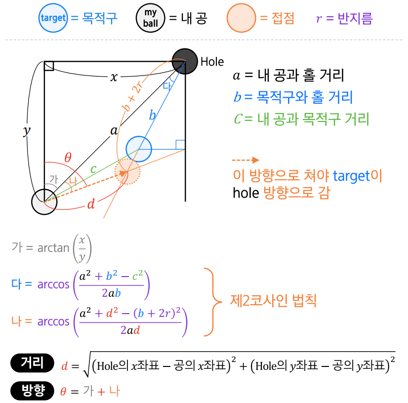

## 필요한 정보
1. 흰 공의 x, y
2. 목적 공의 x, y
3. 홀의 x, y

## 결과
1. 거리(힘)
2. 각도

## 순서
1. 사분면 선택
2. 홀 선택  
  \+ 편의상 홀 위치 번호 부여  
   1 2 3  
   4 5 6
3. 거리와 각도 계산

## 계산에 필요한 값

r = 반지름  
a = 내공과 홀의 거리  
b = 목적구와 홀의 거리  
c = 내공과 목적구 거리  
  
가  
다  
d(거리)  
나
angle(각도)

## 함수 만들기
### 1. 목적구 선택 함수
```python
target = []
# 시험치는 동안은 무조건 선공 = 내 목적구는 1, 3, 8
판안에 해당 공이 있으면 append
append하는 순서는 1, 3, 8 순으로
목적구는 target.pop(0)

+ 심화
1. 내 공과 거리가 가까운 공부터(8 제외하고)
2. 홀과 거리가 가까운 공부터
3. 내공~목적구, 목적구~홀까지 방해구가 없는 공부터
```
### 2. 사분면 선택 함수
- 필요 인자 : 흰 공의 x, y 위치, 목적구의 x, y 위치
- 출력 결과 : 사분면 번호
  
1. 흰 공의 x < 목적구의 x and 흰 공의 y < 목적구의 y  
   = 1사분면
2. 흰 공의 x < 목적구의 x and 흰 공의 y > 목적구의 y  
   = 2사분면
3. 흰 공의 x > 목적구의 x and 흰 공의 y < 목적구의 y  
   = 4사분면
4. 흰 공의 x > 목적구의 x and 흰 공의 y > 목적구의 y  
   = 3사분면
   
### 3. 홀 선택 함수
- 필요 인자 : 사분면 번호, 목적구의 x, y 위치
- 출력 결과 : 홀의 x, y 위치

1. 1사분면일 경우
   1. 목적구의 x가 홀2의 x보다 작다 => 2번 홀
   2. 크다 => 3번 홀

2. 2사분면일 경우
   1. 목적구의 x가 홀5의 x보다 작다 => 5번 홀
   2. 크다 => 6번 홀

3. 3사분면일 경우
   1. 목적구의 x가 홀5의 x보다 작다 => 4번 홀
   2. 크다 => 5번 홀

4. 4사분면일 경우
   1. 목적구의 x가 홀2의 x보다 작다 => 1번 홀
   2. 크다 => 2번 홀

### 4. 거리와 각도 결정 함수
- 필요 인자 : 사분면 번호, 흰 공의 x, y, 목적 공의 x, y, 홀의 x, y
- 출력 결과 : 거리(dist), 각도(angle)

